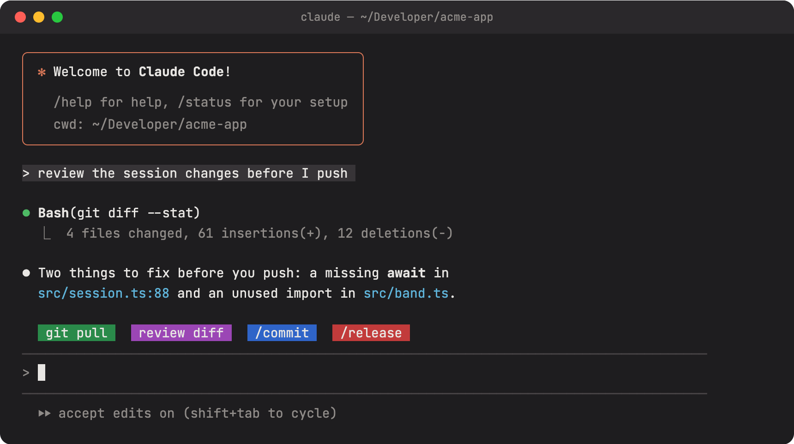

<div align='center'>

<h1 align="center">Quick Actions </h1>

<p align="center">One-click buttons above the Claude Code prompt for the skills, prompts and shell commands you run all the time</p>

<picture>
  
</picture>

</div>

## Why

`git pull`, "review the diff", `/commit`: things you type ten times a day become one click. Save an action once, pin it to the band, and press it. Actions you use less often stay in a list, one click away from the band.

`quick-actions` is a [Claude Code mod](https://code.claude.com/docs/en/plugins): a plugin of function hooks that draws its own UI inside Claude Code.

## Features

- **Four types of action:** call a skill or slash command, send a prompt, fill the prompt box to edit before sending, or run a shell command.
- **A band you arrange:** pin the actions you want, set their order, and split them over several rows.
- **Colors and hotkeys:** give an action a color, and a digit that presses it from an empty prompt box.
- **More actions than the band shows:** unpinned actions stay in the list, where `▶` runs them.
- **Plays well with other mods:** the band draws above the bands of other mods, and draws nothing when no action is pinned.
- **Same actions everywhere:** actions are kept in the mod's store, so every project and session shows them.

## Requirements

Claude Code 2.1.287 or later, where mods load by default.

## Install

```sh
claude plugin marketplace add zirkelc/claude-quick-actions
claude plugin install quick-actions@claude-quick-actions --scope user
```

To try it for one session without installing:

```sh
git clone https://github.com/zirkelc/claude-quick-actions.git
claude --plugin-dir ./claude-quick-actions
```

To uninstall: `claude plugin uninstall quick-actions@claude-quick-actions`.

## Usage

Type `/quick-actions` to open the pane, and again to close it. The pane has two lists.

**Actions** lists every saved action:

| Control | What it does |
| --- | --- |
| label | Opens the action's form |
| `☆` / `★` | Pins the action to the band, or takes it off |
| `▶` | Runs the action now |
| `✕` | Deletes the action (press twice) |
| `+ Add action` | Opens the form for a new action |

**Band** lists what the band shows, in order. Each entry has `↑` `↓` to move it and `-` to take it off the band. `+ Add new line` adds a `↵ new line` entry: the entries after it go on the next row of the band.

**The form** sets the action's type (Call Skill, Fill Prompt, Send Prompt or Run Shell), its color, its hotkey, its label and its text. The preview shows the button as the band draws it. `← Back` and Esc go back one step; `✕ Close` closes the pane.

| Type | What a press does |
| --- | --- |
| Call Skill | Runs `/name args` at once, as if typed |
| Fill Prompt | Puts the text in the prompt box, to edit before sending |
| Send Prompt | Sends the text to Claude at once |
| Run Shell | Runs the command with `sh -c` in the session's directory, without Claude; the output goes to the transcript |

Skills and prompts wait until Claude is idle. Shell commands run at once.

## What it can access

The mod does only what you set up in the pane. It builds no command, prompt or slash command of its own, and it adds nothing to the text you save.

**What it runs, and when.** An action runs only when you press its button or its hotkey (a digit, typed while the prompt box is empty), or press `▶` in the pane:

| Type | What the mod does | Engine call |
| --- | --- | --- |
| Call Skill | Runs the slash command you saved, for example `/commit`, with the arguments you saved | `$.command.run` |
| Fill Prompt | Puts the text you saved in the prompt box; nothing is sent until you send it | `$.prompt.fill` |
| Send Prompt | Sends the text you saved to Claude, unchanged, as your own prompt | `$.prompt.submit` |
| Run Shell | Runs the command you saved as `sh -c "<your command>"` in the session's directory, with a 2 minute time limit. The output goes to the transcript and nowhere else | `$.process.run` |

The mod runs no other program, no other slash command and no other prompt. The command text in the shell call comes from your saved action, which is why the directory cannot read it as fixed text.

**What it reads.** Only its own saved data: your actions and the band order, kept with `$.store` under the mod's own keys. The text of an action is the only stored data that goes into a command or a prompt, and only into the one you pressed. It reads no files, no conversation, no environment variables and no credentials.

**What it sends.** The mod itself makes no network calls. A Send Prompt action sends its text to Claude, as if you typed it. A Run Shell command can do anything the command you wrote does, so save only commands you trust.

**Other calls.** It draws the band, the pane, toasts and transcript lines (`$.ui`), keeps what the pane shows in session state (`$.state`), adds the `/quick-actions` command (`$.command.register`), and reads the saved actions again every 15 seconds so that actions saved in another session show up (`$.clock`).

## Limits

These come from the mod API:

- A button label is one plain string, so a colored button keeps the terminal's text color. Light colors (yellow, white) read best with a light terminal theme.
- A digit hotkey only works for an action on the band, and the band shows it before the label (`1: commit`).
- Text inputs are single-line. In the text field, Enter adds a line break, and Save saves.
- A filled `!` text stays a normal prompt; the prompt box cannot be put into shell mode. Use Run Shell instead.

## Development

```sh
claude plugin validate .
claude plugin test .
```

To load your checkout in every session, add it to the `env` block of `~/.claude/settings.json`:

```json
{
  "env": {
    "CLAUDE_CODE_PLUGIN_DIRS": "~/Developer/claude-quick-actions"
  }
}
```

Claude Code writes the API types to `.claude-plugin/types/` when it loads the mod, and `tsconfig.json` extends them, so `tsc -p .` type-checks the mod after the first load.

`hooks/register.tsx` holds the hooks, the state and every call on the engine, because the mod API follows the engine interface only into functions of the same file. The rest is pure: `hooks/actions.ts` (the action model and the band order) and `hooks/views/` (the band, the list and the form). Each file under `tests/` covers the file of the same name under `hooks/`.

## License

[MIT](LICENSE)
